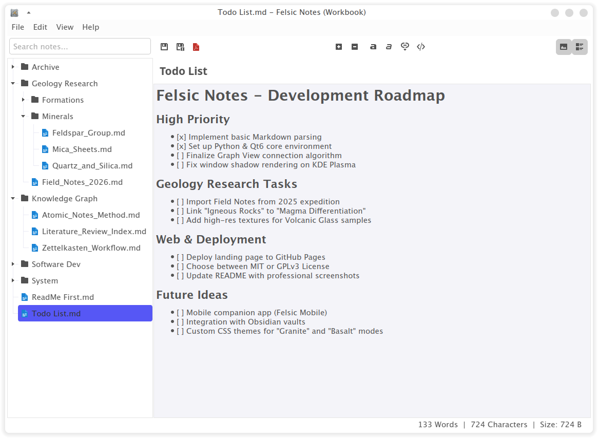

# Felsic Notes

> **Frictionless notes. Pure productivity.**

Felsic Notes is a local-first, lightweight Markdown editor engineered for speed and portability. Built with Qt6 and Python, it delivers a native experience that keeps pace with your thoughts—not the other way around.

This project does not aim to be a fully featured alternative to Obsidian; rather, it is a streamlined sidekick for your daily note-taking, designed to be fast, portable, and distraction-free.

## Key Features

- **Truly Portable**: Run Felsic from anywhere—USB drives, cloud folders (OneDrive, Google Drive), or your desktop. Zero installation required.
- **Native Performance**: Built with Qt6 for millisecond startup times and optimized memory usage (typically under 100MB RAM).
- **Obsidian Companion**: Seamlessly edit your Obsidian vaults without interference. Use both editors simultaneously without conflicts.
- **Pure Markdown**: Your data is yours. Notes are saved as standard `.md` files with no proprietary formats or vendor lock-in.
- **Lightning-Fast Search**: Find any note instantly with a local search engine optimized for extreme speed.
- **Multiplatform**: A consistent, native experience across Windows, macOS, and Linux.

## Getting Started

1. **Download**: Grab the latest version for your OS from the [Releases](https://github.com/deomkds/felsic-notes/releases) page.
2. **Launch**: Open the application (no installation needed).
3. **Select Folder**: Point Felsic to your notes folder or Obsidian vault and start writing.

## Roadmap

- [ ] Multi-language support (Translations)
- [ ] Global search (Search inside note contents)
- [ ] Improved keyboard navigation

## License

Felsic Notes is free software licensed under the GPL-3.0. See the [LICENSE](https://github.com/deomkds/felsic-notes/blob/main/LICENSE) file for details.